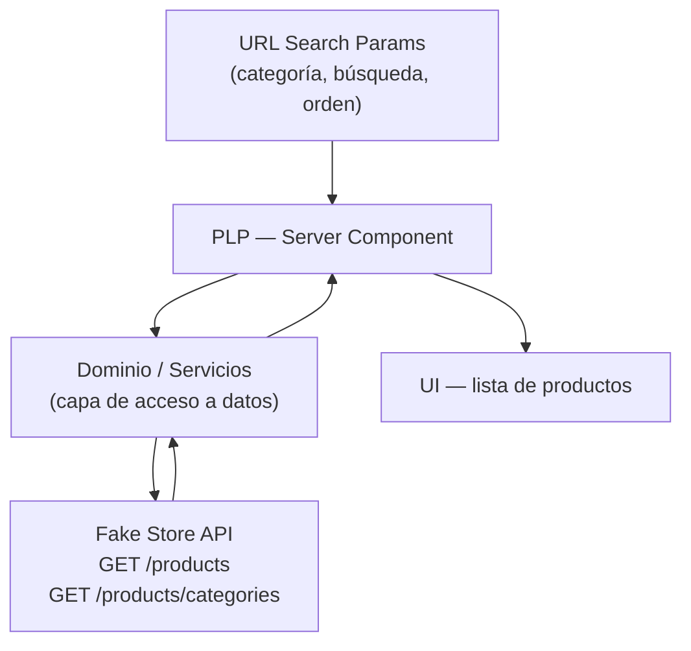
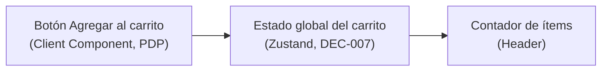

# Arquitectura — Delosi Ecommerce

Este documento describe la **arquitectura objetivo** del reto: la organización hacia la que se diseña la aplicación, distinguiendo explícitamente entre lo que ya está **decidido** (aunque todavía no esté implementado en código) y lo que sigue **abierto**. Ninguna sección de este documento debe leerse como "ya implementado" — para eso existe [CHECKLIST.md](./CHECKLIST.md), que lleva el estado real.

## Objetivos arquitectónicos

- Permitir que PLP, PDP y carrito se desarrollen y evolucionen de forma independiente.
- Minimizar el acoplamiento entre la obtención de datos (Fake Store API), la lógica de dominio y la presentación (UI).
- Facilitar la colaboración entre varios desarrolladores sin conflictos de responsabilidad.
- Cumplir los criterios técnicos del reto: performance, SEO y UX (pilares de evaluación explícitos del reto), resiliencia, TypeScript estricto, SOLID/Clean Code, testabilidad.

## Principios

- **Separación de responsabilidades**: la obtención de datos, la lógica de negocio (filtrado, orden, cálculo de totales del carrito) y la presentación deben poder razonarse por separado.
- **Server-first**: usar Server Components por defecto; introducir Client Components solo donde se requiera interactividad (filtros, carrito, formularios).
- **Tipado estricto**: todo el código nuevo debe tipar explícitamente las respuestas de la API y los modelos de dominio, sin recurrir a `any`.
- **Explicitud sobre las decisiones**: toda decisión relevante (estado del carrito, caché, testing, estructura de carpetas) debe quedar registrada en [DECISIONS.md](./DECISIONS.md) con su justificación, no solo implementada implícitamente.

## Capas previstas: UI, dominio/servicios y acceso a datos

**Decisión tomada (separación de capas, a nivel conceptual):**

- **UI** (Server y Client Components): presenta datos ya transformados; no conoce la forma cruda de la respuesta de Fake Store API.
- **Dominio / servicios**: contiene la lógica de negocio (filtrado, ordenamiento, cálculo de totales del carrito) y expone modelos de dominio tipados, independientes del formato de la API externa.
- **Acceso a datos**: capa responsable de llamar a Fake Store API y traducir sus respuestas al modelo de dominio.

**Pendiente:** la ubicación exacta de cada capa en la estructura de carpetas (ver "Estructura por dominios/módulos" más abajo).

## Arquitectura propuesta por dominios/módulos

**Decisión pendiente.** Se evalúa organizar el código por dominio funcional (p. ej. `products`, `cart`) en lugar de por tipo técnico (`components`, `hooks`, `utils`), para favorecer la escalabilidad y la colaboración entre desarrolladores. La estructura final de carpetas por dominio, y el límite exacto entre "dominio" y "shared/UI", todavía no se ha definido ni implementado.

## Separación entre Server Components y Client Components

**Decisión tomada (principio general):** se usarán Server Components como opción por defecto para la carga y el procesamiento inicial de datos (PLP, PDP), reservando los Client Components para los puntos de interactividad explícitamente requeridos por el reto:

- Controles de filtro/búsqueda/orden en la PLP (si requieren interacción inmediata en cliente).
- Botón "Agregar al carrito" y cualquier UI que lea/actualice el estado del carrito.
- Contador de ítems en el Header.

**Pendiente:** el límite exacto de qué sub-componentes de filtros serán Server vs. Client, y el mecanismo concreto de sincronización entre Server Components y el estado de Search Params, se definirá durante la implementación.

## Integración con Fake Store API

**Decisión tomada:** Fake Store API (`https://fakestoreapi.com`) es la fuente de datos del reto, sin backend propio:

- `GET /products` — listado para PLP.
- `GET /products/categories` — categorías para filtrado en PLP.
- `GET /products/{id}` — detalle para PDP.

**Pendiente:** la forma concreta de la capa de acceso a datos (ubicación del código, manejo de errores de red, tipado de las respuestas) se definirá en la implementación.

## Estrategia prevista para PLP

Arquitectura objetivo (no implementada):

- Ruta `/products`, implementada como Server Component que lee `searchParams` y compone la UI en servidor.
- Filtros por categoría, búsqueda por texto y ordenamiento reflejados en la URL, para que la página sea enlazable, compartible y navegable con el botón "atrás".
- Filtros y búsqueda Server-first: enlaces (`<a>`) y formularios GET. Un Client Component solo se justifica ante una necesidad concreta de interacción inmediata (por ejemplo, búsqueda con debounce).
- Loading state básico (`loading.js` estándar de Next.js), distinto de la iniciativa de proactividad "Streaming + Suspense + Skeletons" (ver más abajo).
- **Acceso a datos ([DEC-008](./DECISIONS.md), decidido):** los datos se obtienen en el servidor, desde Server Components, con las capacidades nativas de Next.js. No se usa React Query en esta fase.
- **Caché y revalidación (pendiente):** la política concreta se decidirá en una decisión posterior, según la frescura necesaria del catálogo.

## Contrato conceptual del PLP

Definido a nivel conceptual; su implementación está pendiente.

**Ruta:** `/products`.

**Parámetros de URL (Search Params):**

| Parámetro | Significado | Si está ausente | Si el valor es inválido |
|---|---|---|---|
| `category` | Filtra por una categoría de Fake Store API. Los valores válidos son los devueltos por `GET /products/categories`. | Sin filtro de categoría: se muestran todos los productos. | Se ignora (equivale a ausente). |
| `q` | Búsqueda textual sobre el título del producto, por coincidencia parcial y sin distinguir mayúsculas. *Propuesto: solo título; pendiente confirmar si entra la descripción.* | Sin búsqueda. | Se normaliza; si queda vacío, equivale a ausente. |
| `sort` | Ordenamiento por criterio de negocio. *Propuesto: `price-asc` y `price-desc`; pendiente de confirmación.* | Orden por defecto (el que devuelve la fuente, sin reordenar). | Se ignora y se usa el orden por defecto. |

**Sin parámetros:** `/products` muestra todos los productos, sin filtro de categoría ni búsqueda, con el orden por defecto, y ofrece las categorías disponibles como opciones de filtro.

**Combinación:** los filtros se combinan con AND. El orden de aplicación es: categoría, luego búsqueda, luego orden.

**Reglas conceptuales de normalización y validación:**
- Los parámetros fuera de este contrato se ignoran.
- Si un parámetro aparece varias veces, se considera solo el primer valor (*propuesto*).
- `q`: se eliminan espacios al inicio y al final, se colapsan los espacios internos, y la comparación no distingue mayúsculas. Tiene una longitud máxima razonable (valor exacto pendiente).
- `category`: debe coincidir con una categoría devuelta por la API; si no coincide, se ignora.
- `sort`: solo acepta los valores del contrato; cualquier otro equivale a ausente.
- Un valor inválido nunca produce 404 ni 500: la página siempre renderiza, usando el valor por defecto del parámetro afectado.

**Compatibilidad con URL-driven state y Server Components:** la URL es la única fuente de verdad del estado de filtros. No se duplica en estado de React ni en almacenamiento del navegador. Los Server Components leen `searchParams`; un componente cliente que necesite el valor lo recibe por props.

**SEO:** la URL sin parámetros es el listado canónico. Las combinaciones con `q` son candidatas a canonical hacia `/products` o a `noindex`; la decisión concreta queda pendiente.

## Modelo de dominio `Product`

Conceptual; no implementado.

- `Product` es el modelo que usan el dominio y la UI. Contiene los campos que necesita el PLP y, a futuro, la PDP: identificador, título, precio, categoría, imagen y, si se usa, valoración.
- El modelo pertenece al proyecto: sus nombres de campo y tipos se definen en el proyecto, no se derivan del DTO de Fake Store API.
- El DTO externo (respuesta cruda de Fake Store API) vive únicamente en la capa de acceso a datos. No se propaga a la UI ni al dominio.
- **Responsabilidad de transformación:** convertir DTO → `Product` en la capa de acceso a datos (o en un mapeador junto a ella). Es el único punto que conoce la forma externa; si la API cambia, el impacto queda acotado ahí.
- La transformación incluye validar la forma recibida antes de convertirla. Cómo se valida (guards manuales o librería) queda pendiente.

## Capas conceptuales del PLP

No implementadas. Responsabilidades:

- **API client / acceso a datos:** llamadas a Fake Store API desde el servidor ([DEC-008](./DECISIONS.md)), normalización de errores (red, timeout, 5xx, 522) en estados controlados, y transformación DTO → modelo de dominio. La política de caché y revalidación queda pendiente.
- **Dominio / modelado:** modelo `Product`, normalización de los `searchParams` en una consulta tipada (`ProductListQuery`, nombre propuesto), y funciones puras de filtrado por categoría, búsqueda y orden. No conoce React, `fetch` ni la forma del DTO.
- **UI:** Server Components que componen la página, la lista, las tarjetas y los filtros; Client Components solo donde haya interacción requerida (`CartCounter`, `AddToCartButton`). Recibe datos ya transformados.

Dirección de dependencias: UI → dominio ← acceso a datos. La UI no conoce el DTO; el acceso a datos devuelve modelos de dominio.

## Estado del servidor frente a estado del cliente

Son categorías distintas y no se mezclan:

- **Server state (catálogo):** productos y categorías. Se leen en Server Components, se derivan de la URL y no se almacenan en el cliente. Su fuente es Fake Store API, a través de la capa de acceso a datos.
- **Client state (carrito):** ítems del carrito. Se gestiona con Zustand y `persist` ([DEC-007](./DECISIONS.md)). Ningún Server Component lo consulta.

Un Client Component que necesite datos del catálogo los recibe por props desde el Server Component que los obtuvo.

## Estados esperados del PLP

Definidos a nivel de comportamiento; su implementación técnica está pendiente.

- **loading:** la lista de productos o las categorías aún no están disponibles. Se muestra la estructura de la página sin saltos de diseño.
- **success:** hay al menos un producto que cumple los filtros activos. Se muestran la lista y los controles con su estado actual.
- **empty:** la consulta es válida y la API respondió, pero ningún producto cumple los filtros. Se muestra un mensaje y la opción de quitar filtros. No es error.
- **error:** la API no respondió o devolvió una respuesta inesperada. Se muestra un mensaje explicativo; la página no queda en blanco ni rota. Es el mínimo defensivo de la sección de resiliencia.

Reglas de frontera: una categoría sin productos es `empty`, no `error`. Un parámetro inválido no es `error`: se normaliza y la página sigue en `success` o `empty`. El estado del carrito no altera los estados del PLP.

## Estrategia prevista para PDP

Arquitectura objetivo (no implementada):

- Ruta dinámica `/products/[id]` como Server Component.
- Generación de metadata dinámica (título, descripción) y Open Graph a partir de los datos del producto obtenido.
- Botón "Agregar al carrito" como punto de interactividad en Client Component, que se conecta al estado global del carrito.

## Estrategia del carrito

Decidido e implementado ([DEC-007](./DECISIONS.md)):

- Estado global con Zustand (`lib/cart/store.ts`), persistencia en `localStorage` mediante el middleware `persist` y flag `hasHydrated` para gestionar la hidratación.
- `CartCounter` (Header) y `AddToCartButton` son los únicos Client Components que leen o escriben el store.
- Fuera de alcance actual: sincronización entre pestañas y `clearCart`.

## Performance y testing como preocupaciones arquitectónicas

- **Performance:** la separación UI/dominio/acceso a datos permite optimizar la capa de acceso a datos (caché/revalidación) sin afectar la UI. La optimización de imágenes externas, el lazy loading y la prevención de layout shift se apoyan en `next/image`, ya disponible en el stack decidido (no requieren una nueva dependencia).
- **Testing:** la separación de capas busca que la lógica de dominio (filtrado, orden, cálculo de totales) sea testeable de forma aislada, sin depender de red ni de Server/Client Components. La herramienta concreta (Jest, React Testing Library, Cypress, Playwright) sigue sin decidirse.

## Resiliencia y manejo de errores

Se distinguen dos niveles, para no convertir una iniciativa de proactividad en requisito obligatorio:

- **Mínimo defensivo esperado (alcance base, no proactividad):** si una llamada a Fake Store API falla o devuelve una respuesta inesperada, la UI no debe quedar en un estado roto o en blanco sin explicación. La resiliencia es requisito real, no teórico: durante la evaluación del 2026-10-04 la API respondió HTTP 522. Según [DEC-008](./DECISIONS.md), los errores de red, timeouts, respuestas 5xx y 522 se normalizan en la capa de acceso a datos y se exponen como estado `error` del PLP. Una respuesta válida sin productos es `empty`, no `error`. Los valores concretos de timeout y el componente que muestra el mensaje quedan para la implementación.
- **Fallback de demostración (iniciativa de resiliencia, no implementada):** puede documentarse como fallback explícito cuando la API no responde. No debe ser silencioso, no debe persistir ni presentar como datos de la API los datos de demostración, no modifica el modelo `Product` para indicar la fuente y no sustituye a la API de forma permanente.
- **Iniciativas de proactividad (no obligatorias):** manejo de errores mediante `error.js` de Next.js, Empty States elaborados, y cualquier tratamiento más allá del mínimo defensivo anterior, descritos en el PDF como ejemplos de proactividad. Su seguimiento se mantiene en [CHECKLIST.md](./CHECKLIST.md) (sección de iniciativas adicionales), para no presentarlas como requisito.

## Diagrama de arquitectura (objetivo)

## Flujo de datos previsto — PLP

## Flujo de datos previsto — Carrito

## Resumen de decisiones pendientes

Explícitamente no resueltas por este documento, a definir y registrar en [DECISIONS.md](./DECISIONS.md):

- Política concreta de caché y revalidación de datos del PLP (decisión posterior a [DEC-008](./DECISIONS.md), que fija el acceso server-side y no fija ningún valor de `revalidate`).
- Confirmación de los valores propuestos del contrato del PLP: criterio de orden (`sort`), alcance de la búsqueda (`q`) y longitud máxima de `q`.
- Forma de validar la respuesta externa (guards manuales o librería).
- Estrategia definitiva de testing (alcance y herramienta: Jest, React Testing Library, Cypress, Playwright).
- Estructura final de carpetas por dominio.

Resueltas desde la última versión de este documento: tecnología y persistencia del estado del carrito ([DEC-007](./DECISIONS.md)).
