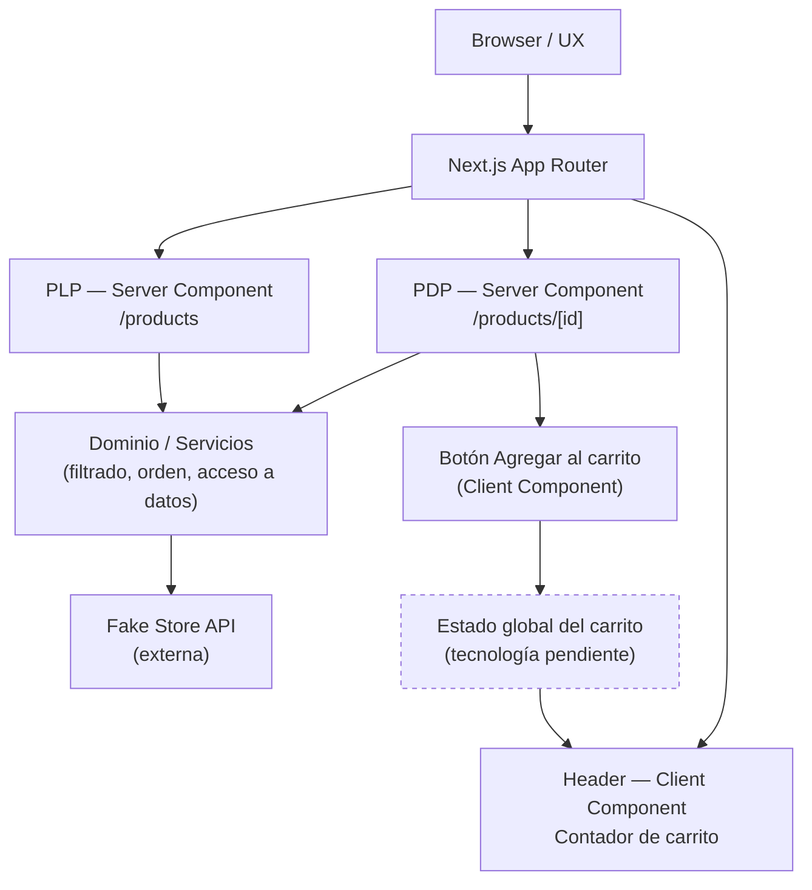
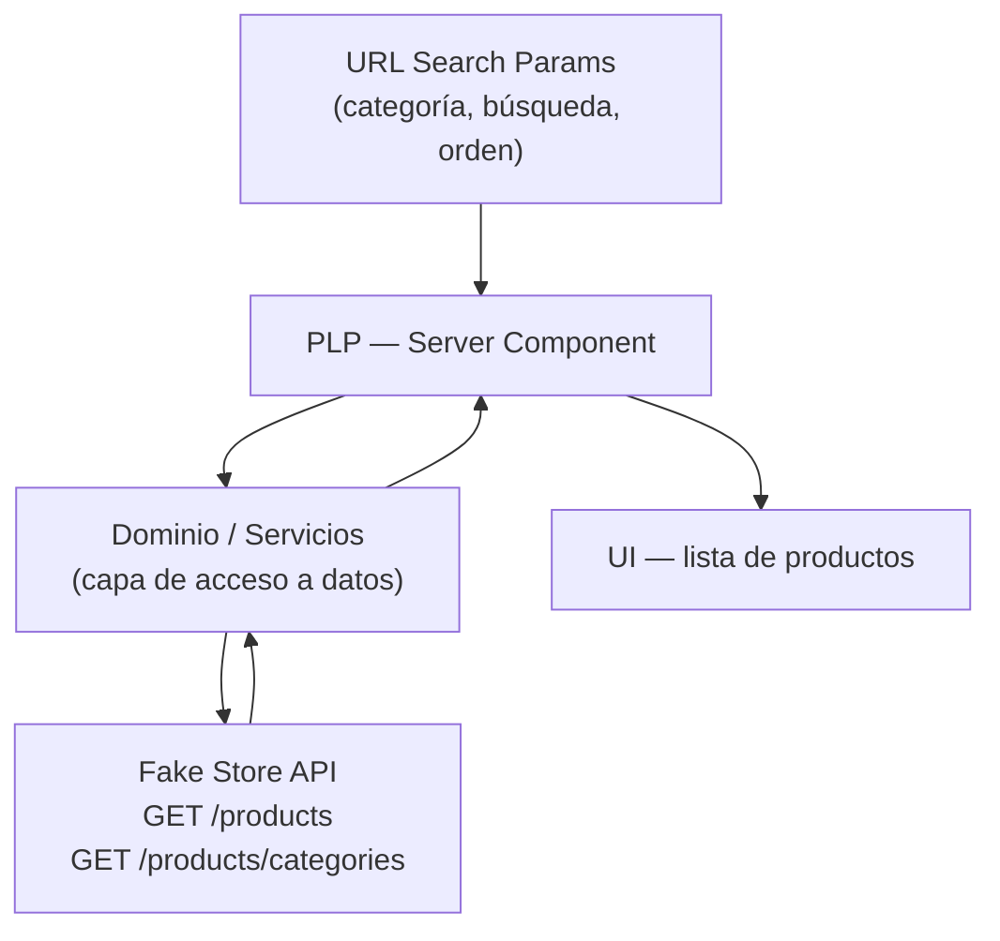
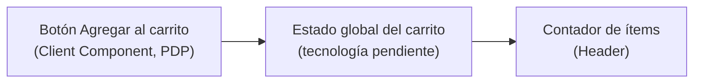

# Arquitectura — Delosi Ecommerce

Este documento describe la **arquitectura objetivo** del reto: la organización hacia la que se diseña la aplicación, distinguiendo explícitamente entre lo que ya está **decidido** (aunque todavía no esté implementado en código) y lo que sigue **abierto**. Ninguna sección de este documento debe leerse como "ya implementado" — para eso existe [CHECKLIST.md](./CHECKLIST.md), que lleva el estado real.

## Objetivos arquitectónicos

- Permitir que PLP, PDP y carrito se desarrollen y evolucionen de forma independiente.
- Minimizar el acoplamiento entre la obtención de datos (Fake Store API), la lógica de dominio y la presentación (UI).
- Facilitar la colaboración entre varios desarrolladores sin conflictos de responsabilidad.
- Cumplir los criterios técnicos del reto: performance, SEO y UX (pilares de evaluación explícitos del reto), resiliencia, TypeScript estricto, SOLID/Clean Code, testabilidad.

## Principios

- **Separación de responsabilidades**: la obtención de datos, la lógica de negocio (filtrado, orden, cálculo de totales del carrito) y la presentación deben poder razonarse por separado.
- **Server-first**: usar Server Components por defecto; introducir Client Components solo donde se requiera interactividad (filtros, carrito, formularios).
- **Tipado estricto**: todo el código nuevo debe tipar explícitamente las respuestas de la API y los modelos de dominio, sin recurrir a `any`.
- **Explicitud sobre las decisiones**: toda decisión relevante (estado del carrito, caché, testing, estructura de carpetas) debe quedar registrada en [DECISIONS.md](./DECISIONS.md) con su justificación, no solo implementada implícitamente.

## Capas previstas: UI, dominio/servicios y acceso a datos

**Decisión tomada (separación de capas, a nivel conceptual):**

- **UI** (Server y Client Components): presenta datos ya transformados; no conoce la forma cruda de la respuesta de Fake Store API.
- **Dominio / servicios**: contiene la lógica de negocio (filtrado, ordenamiento, cálculo de totales del carrito) y expone modelos de dominio tipados, independientes del formato de la API externa.
- **Acceso a datos**: capa responsable de llamar a Fake Store API y traducir sus respuestas al modelo de dominio.

**Pendiente:** la ubicación exacta de cada capa en la estructura de carpetas (ver "Estructura por dominios/módulos" más abajo).

## Arquitectura propuesta por dominios/módulos

**Decisión pendiente.** Se evalúa organizar el código por dominio funcional (p. ej. `products`, `cart`) en lugar de por tipo técnico (`components`, `hooks`, `utils`), para favorecer la escalabilidad y la colaboración entre desarrolladores. La estructura final de carpetas por dominio, y el límite exacto entre "dominio" y "shared/UI", todavía no se ha definido ni implementado.

## Separación entre Server Components y Client Components

**Decisión tomada (principio general):** se usarán Server Components como opción por defecto para la carga y el procesamiento inicial de datos (PLP, PDP), reservando los Client Components para los puntos de interactividad explícitamente requeridos por el reto:

- Controles de filtro/búsqueda/orden en la PLP (si requieren interacción inmediata en cliente).
- Botón "Agregar al carrito" y cualquier UI que lea/actualice el estado del carrito.
- Contador de ítems en el Header.

**Pendiente:** el límite exacto de qué sub-componentes de filtros serán Server vs. Client, y el mecanismo concreto de sincronización entre Server Components y el estado de Search Params, se definirá durante la implementación.

## Integración con Fake Store API

**Decisión tomada:** Fake Store API (`https://fakestoreapi.com`) es la fuente de datos del reto, sin backend propio:

- `GET /products` — listado para PLP.
- `GET /products/categories` — categorías para filtrado en PLP.
- `GET /products/{id}` — detalle para PDP.

**Pendiente:** la forma concreta de la capa de acceso a datos (ubicación del código, manejo de errores de red, tipado de las respuestas) se definirá en la implementación.

## Estrategia prevista para PLP

Arquitectura objetivo (no implementada):

- Carga inicial de productos y categorías en un Server Component.
- Filtros por categoría, búsqueda por texto y ordenamiento reflejados y leídos desde Search Params de la URL, para que la página sea enlazable/compartible y soporte navegación con botón "atrás".
- Loading state básico (`loading.js` estándar de Next.js) mientras se resuelve la carga inicial — buena práctica de UX, distinta de la iniciativa de proactividad "Streaming + Suspense + Skeletons" (ver más abajo).

## Estrategia prevista para PDP

Arquitectura objetivo (no implementada):

- Ruta dinámica `/products/[id]` como Server Component.
- Generación de metadata dinámica (título, descripción) y Open Graph a partir de los datos del producto obtenido.
- Botón "Agregar al carrito" como punto de interactividad en Client Component, que se conecta al estado global del carrito.

## Estrategia prevista para el carrito

Arquitectura objetivo, con varios puntos explícitamente **pendientes de decisión**:

- El carrito necesita un estado accesible globalmente (al menos por la PDP y el Header).
- **Pendiente:** tecnología concreta de estado global (p. ej. Context API, Zustand, Redux u otra). No se asume Zustand ni ninguna otra librería todavía.
- **Pendiente:** estrategia de persistencia del carrito (memoria, `localStorage`, cookies, u otra).
- **Pendiente:** justificación formal de la estrategia elegida, a documentar en [DECISIONS.md](./DECISIONS.md) una vez decidida.

## Performance y testing como preocupaciones arquitectónicas

- **Performance:** la separación UI/dominio/acceso a datos permite optimizar la capa de acceso a datos (caché/revalidación) sin afectar la UI. La optimización de imágenes externas, el lazy loading y la prevención de layout shift se apoyan en `next/image`, ya disponible en el stack decidido (no requieren una nueva dependencia).
- **Testing:** la separación de capas busca que la lógica de dominio (filtrado, orden, cálculo de totales) sea testeable de forma aislada, sin depender de red ni de Server/Client Components. La herramienta concreta (Jest, React Testing Library, Cypress, Playwright) sigue sin decidirse.

## Resiliencia y manejo de errores (iniciativa de proactividad)

El manejo de errores de API mediante `error.js` y los Empty States son iniciativas de proactividad descritas en el PDF, no parte del alcance mínimo obligatorio. Su seguimiento se mantiene en [CHECKLIST.md](./CHECKLIST.md) (sección de iniciativas adicionales), para no presentarlas como requisito.

## Diagrama de arquitectura (objetivo)

> El nodo punteado ("Estado global del carrito") representa una decisión aún abierta: existe el concepto, no la tecnología.

## Flujo de datos previsto — PLP

## Flujo de datos previsto — Carrito

## Resumen de decisiones pendientes

Explícitamente no resueltas por este documento, a definir y registrar en [DECISIONS.md](./DECISIONS.md):

- Tecnología de estado global del carrito.
- Estrategia de persistencia del carrito.
- Estrategia exacta de caché/revalidación de datos.
- Estrategia definitiva de testing (alcance y herramienta: Jest, React Testing Library, Cypress, Playwright).
- Estructura final de carpetas por dominio.
