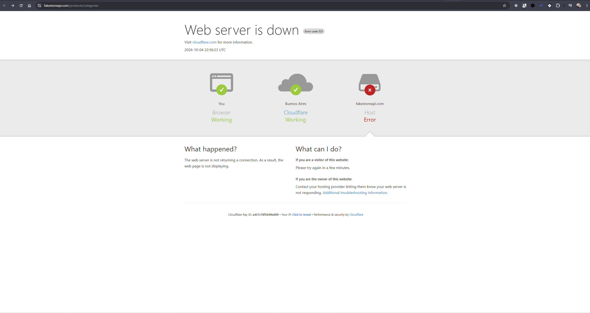
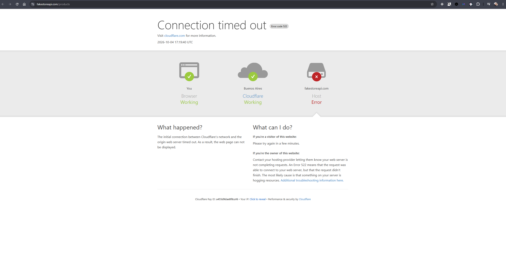
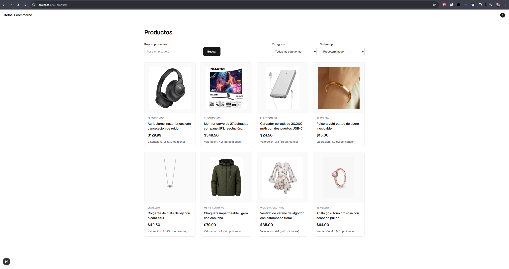
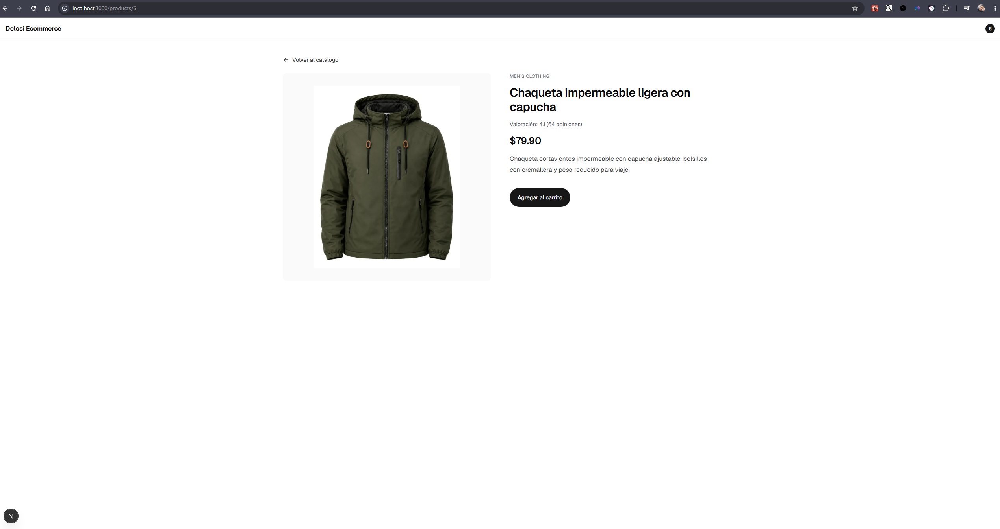
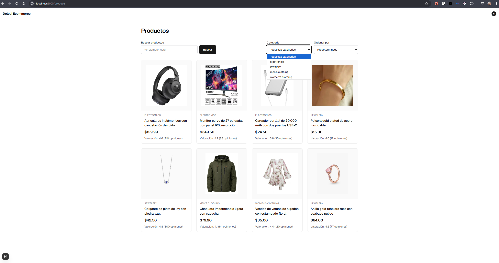

# Decisions

Decision log (ADR-style) para el reto Delosi Ecommerce. Se registran aquí las decisiones confirmadas (`Accepted`) y las decisiones abiertas que requieren evaluación explícita (`Proposed`, sin decidir). Los detalles de diseño que no están registrados como decisión (por ejemplo, la longitud máxima de `q`) se documentan en [ARCHITECTURE.md](./ARCHITECTURE.md).

---

## DEC-001 — Framework y routing

**Status:** Accepted

**Context:**
El reto requiere una PLP con Server Components para carga/procesamiento inicial y una PDP en ruta dinámica (`/products/[id]`) con metadata dinámica y Open Graph. Se necesita un framework React con soporte nativo de Server Components, rutas dinámicas y generación de metadata.

**Decision:**
Usar Next.js con App Router (confirmado por el bootstrap generado con `create-next-app`, Next.js 16.3.8).

**Rationale:**
App Router provee Server Components, generación de metadata por ruta y soporte nativo de Open Graph, que son requisitos explícitos del reto.

**Consequences:**
La estructura de rutas y la separación Server/Client Components se apoyan en las convenciones de App Router (`app/`, `layout.tsx`, `page.tsx`, `metadata`).

---

## DEC-002 — Lenguaje

**Status:** Accepted

**Context:**
El reto exige TypeScript estricto como criterio técnico.

**Decision:**
Usar TypeScript con `strict: true` (confirmado en `tsconfig.json` del bootstrap).

**Rationale:**
Requisito explícito del reto; además reduce errores en tiempo de compilación al integrar datos externos de Fake Store API.

**Consequences:**
Todo el código nuevo debe tipar explícitamente los modelos de dominio y las respuestas de la API, sin uso de `any`.

---

## DEC-003 — Estilos

**Status:** Accepted

**Context:**
Se necesita una solución de estilos para construir la UI de PLP, PDP, carrito y Header.

**Decision:**
Usar Tailwind CSS v4 (confirmado en el bootstrap: `@tailwindcss/postcss`, `app/globals.css`).

**Rationale:**
Viene preconfigurado por el bootstrap de `create-next-app` y permite iterar rápido en la UI sin introducir una dependencia adicional de CSS.

**Consequences:**
Los estilos se escriben con utilidades de Tailwind; cualquier sistema de diseño adicional (tokens, componentes de UI reutilizables) queda fuera de esta decisión.

---

## DEC-004 — Fuente de datos

**Status:** Accepted

**Context:**
El reto exige integrar PLP y PDP contra una API externa específica, sin backend propio.

**Decision:**
Usar Fake Store API (`https://fakestoreapi.com`) como única fuente de datos del reto:

- `GET /products`
- `GET /products/categories`
- `GET /products/{id}`

**Rationale:**
Es la API provista explícitamente por el documento del reto.

**Consequences:**
No se implementa backend ni base de datos propia. La disponibilidad y el contrato de datos del proyecto dependen de Fake Store API.

---

## DEC-005 — Control de versiones y repositorio

**Status:** Accepted

**Context:**
El reto exige un repositorio público como entregable.

**Decision:**
Usar Git como control de versiones, con repositorio remoto en GitHub (`origin`). Al momento de tomar esta decisión, el commit inicial (`fb9d8a4`) ya estaba sincronizado con `origin/main`.

**Rationale:**
Requisito explícito de entregable del reto.

**Consequences:**
El historial de commits y el estado del repositorio remoto son parte de la evidencia de avance del reto. La sincronización con `origin/main` es el estado en el momento de cada commit, no una condición permanente: los commits locales posteriores (por ejemplo `243c12a` y `497a5a6`) pueden adelantar a `main` respecto de `origin/main` hasta que se haga `git push`. En la verificación del 2026-10-04 ambas ramas coincidían. El estado de sincronización vigente se verifica con `git status -sb`, no se asume por esta decisión.

---

## DEC-006 — Migración a pnpm

**Status:** Accepted

**Context:**
El proyecto se inició con npm (`package-lock.json` generado por `create-next-app`). Se decidió adoptar pnpm como package manager del proyecto.

**Decision:**
Usar pnpm como único package manager del proyecto, gestionado vía Corepack. `package-lock.json` fue eliminado y reemplazado por `pnpm-lock.yaml`; se agregó `pnpm-workspace.yaml` (con la aprobación de build scripts requerida por pnpm). El campo `packageManager` en `package.json` fija la versión exacta. Todos los comandos documentados del proyecto (instalación, desarrollo, build, start, lint) usan pnpm.

**Rationale:**
Estandarizar el package manager del proyecto antes de comenzar la implementación funcional.

**Consequences:**
- `pnpm-lock.yaml` es el lockfile vigente; ya no existe `package-lock.json`.
- `pnpm-workspace.yaml` debe conservarse (necesario para reproducir la instalación).
- Esta decisión ya está implementada y commiteada (`497a5a6 — chore: migrate project to pnpm`).

---

## DEC-007 — Estado global y persistencia del carrito

**Status:** Accepted — implementado y validado

**Context:**
El reto requiere un estado global del carrito, accesible desde la PDP (acción "Agregar al carrito") y desde el Header (contador de ítems), con persistencia del carrito y compatibilidad con la arquitectura Server Components / Client Components definida en [ARCHITECTURE.md](./ARCHITECTURE.md). El estado mutable del carrito pertenece necesariamente al cliente: los Server Components no pueden mantener estado interactivo ni reaccionar a eventos de usuario.

**Alternativas consideradas:**
- **Context API + `useReducer`:** solución válida, sin dependencia externa, con un reducer explícito y testeable. Se descartó como recomendación (no como inválida) por requerir más código propio para implementar persistencia y rehidratación, incluyendo construir manualmente la señal/gestión del estado de hidratación.
- **Zustand (elegida):** menor boilerplate para un store global, con selectors y una separación clara entre el store y sus consumidores; adecuado para un único dominio de estado acotado como el carrito.
- **Redux Toolkit / Jotai / Valtio:** descartadas por no aportar ventaja diferencial para un solo dominio de estado acotado como el carrito — habrían introducido más complejidad o una abstracción distinta sin una necesidad real que lo justifique en este alcance.

**Decision (final, implementada):**
Usar Zustand para el estado global del carrito (`lib/cart/store.ts`), con el middleware `persist` sobre `localStorage` para la persistencia, y un flag `hasHydrated` en el estado para controlar explícitamente cuándo mostrar el valor real del contador.

Justificación precisa (sin sobreafirmar lo que la librería resuelve):
- Zustand simplifica la gestión del estado global en sí (menos boilerplate que Context + `useReducer`, selectors sin esfuerzo manual).
- `persist` simplifica la mecánica de serialización y lectura del estado persistido (evita escribir a mano el guardado/lectura de `localStorage`).
- `localStorage` es suficiente para el alcance actual: no se requiere sincronización entre dispositivos ni backend propio (ver DEC-004), solo persistencia dentro del mismo navegador del usuario.
- `localStorage` sigue siendo exclusivamente client-side: el servidor no puede acceder a ese valor. El render inicial parte de un estado por defecto (carrito vacío); la rehidratación ocurre después, en el cliente.
- `persist` facilita la mecánica de persistencia/rehidratación, pero **no elimina** la responsabilidad de manejar conscientemente el estado de hidratación — eso se resolvió explícitamente con el flag `hasHydrated` (ver "Problema encontrado durante implementación" más abajo).

**Arquitectura:**
- Se mantiene el enfoque server-first ya definido en [ARCHITECTURE.md](./ARCHITECTURE.md): PLP y PDP permanecen principalmente como Server Components.
- `CartCounter` (en el Header) y `AddToCartButton` son las únicas islas Client Component que conocen el store.
- El store (`lib/cart/store.ts`) no debe importarse desde ningún Server Component.

**Problema encontrado durante implementación:**
`onRehydrateStorage` referenciaba inicialmente el binding exportado `useCartStore` durante la propia inicialización del store. Debido a que la rehidratación con `localStorage` se resuelve de forma síncrona, esa referencia se evaluaba antes de que la asignación de `useCartStore` terminara, lo que producía una violación de Temporal Dead Zone. La excepción resultante era absorbida silenciosamente por la cadena interna de `persist`, dejando `hasHydrated` permanentemente en `false` — aunque los datos persistidos sí se recuperaban correctamente, por lo que `items`/el conteo interno existían mientras el contador permanecía visualmente vacío. La corrección fue capturar la referencia `set` dentro de la función creadora del store y usarla en `onRehydrateStorage`, evitando referenciar `useCartStore` durante su propia inicialización.

**Validación:**
- `pnpm lint` → sin errores.
- `pnpm build` → exitoso, TypeScript estricto sin errores.
- Persistencia comprobada manualmente en navegador: agregar producto, refrescar la página, y el contador recupera la cantidad correcta tras la hidratación.
- Flujo completo validado: agregar al carrito → persistir en `localStorage` → reload → rehidratar → mostrar contador actualizado.

**Consequences:**
- Zustand queda incorporado como dependencia del proyecto (`zustand` en `package.json`).
- El componente del contador en el Header maneja explícitamente el estado de hidratación (antes/después de leer `localStorage`).
- `localStorage` permite conservar el carrito entre refresh y cierre/reapertura del navegador (mismo origen).
- Impacto en memoria acotado: el store contiene solo `items` (productId, title, price, image y quantity) de los productos añadidos; `persist` escribe únicamente esa parte bajo la clave `delosi-cart`, y `hasHydrated` no se persiste (cubierto por `tests/cart.test.ts`). No se guarda el catálogo, ni respuestas de la API, ni estado de servidor o caché adicional en el store. El tamaño crece solo con el número de productos distintos del carrito, y el catálogo sigue gestionado por la caché de datos de Next.js (DEC-009).

**Límites de esta decisión (lo que sigue sin decidirse):**
- Sincronización entre pestañas — no implementada, sigue fuera de alcance.
- `clearCart` — no forma parte del alcance actual.
- Estructura definitiva de carpetas por dominio — sigue abierta (ver [ARCHITECTURE.md](./ARCHITECTURE.md)).
- Estrategia/framework de testing — sigue abierto.

---

## DEC-008 — Estrategia de acceso y consumo de datos

**Status:** Accepted — acceso a datos server-side con Server Components y capacidades nativas de Next.js. La política de caché y revalidación se decide en [DEC-009](#dec-009--política-de-caché-y-revalidación-del-catálogo).

**Context:**
El PLP (`/products`) y la PDP (`/products/[id]`) necesitan datos de Fake Store API (DEC-004), y el estado de filtros del PLP vive en la URL (ver [ARCHITECTURE.md](./ARCHITECTURE.md), "Contrato conceptual del PLP"). Había que decidir si el acceso ocurre en servidor o en cliente, qué herramienta lo gestiona y qué resiliencia exige.

Hechos conocidos:
- Next.js 16.3.8, sin Cache Components (`next.config.ts` sin `cacheComponents`). Según la guía de Next incluida en `node_modules`, `fetch` sin opciones de caché no cachea en servidor (`auto no cache`); `cache: 'force-cache'` y `next.revalidate` son opt-in.
- Los `searchParams` son una `Promise` y leerlos vuelve la página dinámica en tiempo de request.
- Dentro de un mismo render, `fetch` con la misma URL y opciones se memoiza.
- En desarrollo, la caché HMR puede mostrar datos antiguos entre refrescos.
- Fake Store API no ofrece búsqueda ni ordenamiento en sus endpoints: el filtrado y el orden ocurren fuera de la API.
- Observación del 2026-10-04: durante la validación, Fake Store API respondió HTTP 522 en `/products` y HTTP 521 en `/products/categories` (capturas en [DEC-011](#dec-011--fixtures-explícitos-de-desarrollo-y-test)). No hay medición de disponibilidad histórica.
- El estado del carrito ya vive en cliente con Zustand (DEC-007). No es caché de datos de catálogo.

**Alternativas evaluadas:**
- **A. `fetch` nativo de Next.js dentro de Server Components (elegida).** Encaja con el modelo server-first, renderiza el contenido en el HTML inicial y no añade dependencias. La política de caché (`cache`, `next.revalidate`, etiquetas) es una capa adicional de Next.js que se decidirá aparte.
- **B. React Query (TanStack Query) (no incorporada en esta fase).** Resuelve caché de cliente, deduplicación, refetch y estados de carga en el navegador. Exige Client Components y un provider, y mueve la lectura del catálogo al cliente. Ver la justificación de la sección siguiente.

**Decision:**
1. El catálogo (PLP) y el detalle de producto (PDP) obtienen sus datos en el servidor, desde Server Components, usando las capacidades nativas de Next.js.
2. Los filtros, la búsqueda y el ordenamiento del PLP se representan mediante URL Search Params. La URL es la fuente de verdad del estado de navegación.
3. React Query **no** se incorpora en esta fase.
4. El carrito se mantiene como client state, gestionado con la decisión ya aceptada [DEC-007](#dec-007--estado-global-y-persistencia-del-carrito) (Zustand + `persist`). El server state del catálogo y el client state del carrito son categorías distintas y no se mezclan: el catálogo no se guarda en el store del carrito, y el carrito no se consulta desde Server Components.
5. La política de `cache` y revalidación no se fija en este registro. Se decide en [DEC-009](#dec-009--política-de-caché-y-revalidación-del-catálogo).
6. Los errores de la API se normalizan en la capa de acceso a datos y se exponen a la aplicación como estados controlados (ver [ARCHITECTURE.md](./ARCHITECTURE.md), "Estados esperados del PLP").
7. Se distingue siempre entre respuesta válida sin productos (Empty State) y fallo de API, incluyendo timeout, 5xx y 522 (Error State).
8. Un fallback de demostración explícito queda documentado como **iniciativa de resiliencia**, no como decisión de datos. Cumple estas restricciones: no es silencioso (la UI indica que los datos no son los de la API), no escribe ni persiste datos en nombre de la API real, no añade un campo de origen al modelo `Product`, y no sustituye a la API de forma permanente.

**Rationale:**
La elección se basa en los requisitos del reto, no en preferencia personal ni en la simplicidad del proyecto:
- El reto exige carga y procesamiento inicial del PLP con Server Components, y filtros, búsqueda y orden en URL Search Params. Con esto, el listado se renderiza en servidor y es enlazable y compartible.
- El SEO depende de que el contenido esté en el HTML inicial, lo que favorece `fetch` en servidor frente a lecturas en cliente.
- Los requisitos actuales no demandan las capacidades que justifican React Query: gestión de server state en cliente, polling, refetch automático complejo, mutations remotas (Fake Store API solo expone `GET`, según DEC-004), infinite queries, invalidación compleja de caché en cliente, o sincronización de server state entre varios Client Components.
- Incorporar React Query ahora añadiría un provider, una frontera de Client Components para el catálogo, una segunda capa de caché que duplica la del servidor y complejidad de hidratación, sin resolver un problema que hoy exista.
- La resiliencia es requisito real: la API respondió HTTP 522 y 521 durante la validación del 2026-10-04. Por eso el manejo de errores se normaliza en la capa de acceso a datos, y no depende de la librería elegida.

**Reconsideración de React Query:** se volverá a evaluar solo si aparecen requisitos concretos, por ejemplo búsqueda reactiva sin navegación que deba consultar la API, polling o refetch periódico, escrituras remotas (checkout o similares), scroll infinito, o varios Client Components que necesiten compartir el mismo server state. En ese caso se abrirá una decisión nueva que supersedería esta parte.

**Consequences:**
- El acceso a datos del PLP y de la PDP se implementa en Server Components y en la capa de acceso a datos, sin hooks de fetching en cliente.
- La política de caché y revalidación se registra en [DEC-009](#dec-009--política-de-caché-y-revalidación-del-catálogo) (revalidación de 3600 segundos).
- La capa de acceso a datos debe normalizar: respuesta válida con cero productos (Empty), y fallo de red, timeout, 5xx o 522 (Error).
- El fallback de demostración, si se implementa, es una iniciativa de resiliencia (💡 en [CHECKLIST.md](./CHECKLIST.md)) con las restricciones del punto 8.
- La lógica de dominio (normalización, filtrado, orden) no depende de esta decisión y se diseña de forma independiente.

---

## DEC-009 — Política de caché y revalidación del catálogo

**Status:** Accepted — política de caché y revalidación decidida e implementada en `lib/products/fake-store/client.ts` (`next.revalidate: 3600`). La verificación en runtime del comportamiento ante fallo de revalidación queda pendiente.

**Context:**
[DEC-008](#dec-008--estrategia-de-acceso-y-consumo-de-datos) decidió **cómo** se accede a los datos: en servidor, desde Server Components, con las capacidades nativas de Next.js. DEC-009 fija **con qué política de frescura y caché** se consume el catálogo. Hechos conocidos:
- `fetch` sin opciones de caché no cachea en servidor en Next.js 16.3.8; `cache: 'force-cache'` y `next.revalidate` son opt-in.
- Con `searchParams` la página es dinámica en tiempo de request; la caché de datos y la de la ruta son mecanismos distintos.
- En desarrollo, la caché HMR puede mostrar datos antiguos entre refrescos.
- Fake Store API respondió HTTP 522 en `/products` y HTTP 521 en `/products/categories` durante la validación del 2026-10-04. Cualquier caché debe considerar qué ocurre cuando la revalidación falla.

**Decision:**
Server-side caching con Next.js Data Cache mediante `fetch`, y revalidación basada en tiempo de **3600 segundos (1 hora)** para productos y categorías.

- **Alcance:** `getProducts()` y `getCategories()`, dentro de la capa de acceso a datos ([DEC-010](#dec-010--contrato-de-url-parser-y-arquitectura-del-plp)).
- **Unidad cacheada:** la respuesta completa de `GET /products` y de `GET /products/categories`, sin parámetros de query. `category`, `q` y `sort` se aplican después, en el dominio, sobre los datos obtenidos. Así una sola entrada de caché sirve a todas las combinaciones de filtros.
- Los filtros, la búsqueda y el ordenamiento no forman parte del estado global ni del server state del cliente. URL Search Params sigue siendo la fuente de verdad, según [DEC-010](#dec-010--contrato-de-url-parser-y-arquitectura-del-plp).
- El procesamiento de `category`, `q` y `sort` se realiza sobre los datos obtenidos.
- React Query permanece fuera de alcance según [DEC-008](#dec-008--estrategia-de-acceso-y-consumo-de-datos). Zustand permanece reservado al estado cliente del carrito según [DEC-007](#dec-007--estado-global-y-persistencia-del-carrito).

**Out of scope:**
- React Query.
- Zustand para server state.
- `revalidateTag` e invalidación bajo demanda.
- Cache Components.
- Caché externa o infraestructura de caching adicional.
- Invalidación manual desde un backend propio (el proyecto no controla el backend de Fake Store API).

**Rationale:**
1. El catálogo es un recurso compartido: los mismos productos y categorías sirven a todos los usuarios.
2. No son datos personalizados por usuario, así que una entrada de caché compartida es correcta para todos.
3. La lectura es mucho más frecuente que los cambios esperados del catálogo.
4. Una ventana de una hora reduce las solicitudes a Fake Store API y mejora la performance, sin requerir estado de servidor en el cliente.
5. El valor de 3600 segundos es una política de frescura aceptable para este challenge. **No es una afirmación de que Fake Store API cambie exactamente cada hora.** La frecuencia real de cambios del origen no se conoce.
6. No se elige un intervalo más corto solo para aparentar mayor frescura: aumentaría las solicitudes al origen sin una necesidad demostrada.
7. La invalidación bajo demanda queda fuera de alcance porque el proyecto no controla el backend de Fake Store API y no tiene eventos que escuchar.
8. Cache Components no se introduce: no es necesario para resolver el requisito actual y agregaría complejidad global innecesaria.

**Resiliencia (alineada con [DEC-010](#dec-010--contrato-de-url-parser-y-arquitectura-del-plp)):**
- HTTP 200 con `[]` → `empty`.
- HTTP 522 → `error`.
- HTTP 5xx → `error`.
- Timeout o fallo de red → `error`.
- Payload inválido → `error`.
- Nunca se convierte un error del API en `[]`.
- Según la documentación de `fetch` de Next.js incluida en el proyecto, solo se almacenan respuestas `200`. Un error no debe quedar guardado en caché; esto está pendiente de verificación en runtime.
- La caché es una estrategia de **reducción de dependencia del origen**, no una garantía de disponibilidad.
- Fallback de demostración: iniciativa futura, no implementada. No debe ser silencioso, no debe persistirse, no debe contaminar Zustand ni el carrito, debe reutilizar el mismo modelo `Product` y no añade un campo `source` al dominio.

**Trade-offs:**
- Un cambio en el catálogo puede tardar hasta aproximadamente una ventana de revalidación (1 hora) en reflejarse.
- No existe invalidación inmediata, porque no se controla el backend externo.

**Consequences:**
- Positivas: menor dependencia del API externo; menos solicitudes; mejor performance; arquitectura simple; sin client-side server state.
- Negativas: la frescura del catálogo tiene un retraso de hasta una ventana de revalidación.
- La caché está implementada en `fetchFakeStoreJson`. Pendiente: verificar en runtime que los errores no quedan almacenados y el comportamiento ante fallo de revalidación.
- En la implementación debe verificarse en la versión instalada de Next.js: (a) qué se sirve cuando falla la revalidación en segundo plano, (b) que los errores no quedan almacenados en caché.
- El retry manual ([ARCHITECTURE.md](./ARCHITECTURE.md), "Retry") no está implementado todavía y no fuerza un bypass de caché en esta fase. Se espera que, al no almacenarse los errores, un retry vuelva a consultar al origen; pendiente de verificación en runtime.
- DEC-008 y DEC-010 no se modifican por esta decisión.

---

## DEC-010 — Contrato de URL, parser y arquitectura del PLP

**Status:** Accepted — diseño aprobado e implementado en el checkpoint PLP + PDP. La validación de los estados success y empty con datos reales queda pendiente de Fake Store API.

**Context:**
El PLP necesita un contrato de parámetros estable y compartible, separado de la forma de la API externa, y con estados de error distinguibles de un resultado vacío. Detalle completo en [ARCHITECTURE.md](./ARCHITECTURE.md), secciones "Contrato conceptual del PLP" a "Retry".

**Decision:**
1. Ruta canónica `/products`, con los query params `category`, `q` y `sort`, modelados conceptualmente como `ProductsQuery`.
2. La URL es la fuente de verdad del estado del catálogo. Zustand no almacena filtros, búsqueda, orden ni productos; permanece reservado al carrito ([DEC-007](#dec-007--estado-global-y-persistencia-del-carrito)).
3. `category`: se aplica si corresponde a una categoría presente en el catálogo de productos obtenido; si no, se ignora. Nunca produce 404 ni 500.
4. `q`: búsqueda case-insensitive sobre `Product.title`. No se amplía a descripción ni otros campos en esta fase.
5. `sort`: valores `price-asc` y `price-desc`. Los valores desconocidos se ignoran.
6. Los filtros se combinan con AND, en el orden categoría → búsqueda → orden.
7. Un parser, `parseProductsQuery()`, convierte `URLSearchParams` en `ProductsQuery`. La UI y el acceso a datos no leen `URLSearchParams` directamente. Implementado en `lib/products/parse-query.ts`.
8. La página consume `getProducts(query)` y nunca conoce URLs de Fake Store API. `getCategories()` cubre el endpoint de categorías. Ambas funciones están implementadas en `lib/products/catalog.ts`.
9. `FakeStoreProductDTO` se transforma a `Product` mediante un mapper en la capa de acceso a datos. `Product` no depende del contrato externo y no incluye campo de origen. Campos: `id`, `title`, `price`, `description`, `category`, `imageUrl`, `rating.rate`, `rating.count`.
10. Fake Store API no soporta búsqueda ni ordenamiento: estas operaciones se realizan sobre `Product` en el dominio.
11. Estados: `loading`, `success`, `empty`, `error`. **HTTP 200 con `[]` es `empty`. Un 522, timeout, 5xx o fallo de red es `error`, nunca `[]`.** Los errores externos se normalizan en la capa de acceso a datos.
12. Retry manual desde la UI. No hay retries automáticos en esta fase.
13. El fallback de demostración queda como iniciativa futura, no implementada, con sus restricciones documentadas en [ARCHITECTURE.md](./ARCHITECTURE.md).

**Rationale:**
- Una URL con el estado completo es enlazable, compartible y navegable con el botón "atrás", y cumple el requisito de URL Search Params del reto.
- Separar el DTO externo del modelo `Product` acota el impacto de cambios en la API a un único punto.
- Filtrar y ordenar en el dominio, sobre funciones puras, permite probarlas sin red ni React.
- Distinguir `[]` de error evita mostrar un falso Empty State cuando la API está caída.
- El retry manual evita múltiples solicitudes automáticas innecesarias ante errores como el 522 observado.

**Consequences:**
- La capa de datos (tipos, DTO, mapper, parser, `getProducts`, `getCategories`, `getProduct`) está implementada en `lib/products/`. La UI de `/products` y de `/products/[id]` también está implementada (checkpoint PLP + PDP). Pendiente: validación de éxito con datos reales. Los detalles de implementación están en [ARCHITECTURE.md](./ARCHITECTURE.md), "Decisiones de implementación".
- El skeleton del PLP se mantiene, pero su `loading.tsx` está aislado mediante el route group `app/(catalog)/products/` (`page.tsx` y `loading.tsx`). Así el Suspense boundary no envuelve la PDP y `notFound()` no se convierte en soft 404 HTTP 200. La PDP permanece en `app/products/[id]/` (`page.tsx` y `not-found.tsx`), fuera del route group. Validado en producción: `/products/abc`, `/products/0`, `/products/1.5` y `/products/-3` responden 404; `/products` mantiene su skeleton y la URL pública no cambia.
- La política de caché queda fuera de este registro y se rige por [DEC-009](#dec-009--política-de-caché-y-revalidación-del-catálogo).
- Cualquier cambio en el contrato de parámetros requiere actualizar este registro.

---

## DEC-011 — Fixtures explícitos de desarrollo y test

**Status:** Accepted — implementado. El PLP y la PDP están validados visualmente en desarrollo con fixtures (desktop y móvil), incluido el clic en "Agregar al carrito" y el Back del navegador desde la PDP. La validación contra Fake Store API real sigue pendiente porque el servicio no respondía el 2026-10-04.

**Context:**
Fake Store API ha estado no disponible (HTTP 521/522) durante la implementación del PLP y la PDP. Sin datos de éxito no se pueden validar visualmente el listado, los filtros, la PDP ni el flujo del carrito con datos reales.

**Decision:**
1. Fixtures explícitos, activados con `PRODUCTS_DATA_SOURCE=fixtures` y solo fuera de producción. El modo por defecto es `live`.
2. Los fixtures reemplazan únicamente el transporte de Fake Store API. Pasan por el mismo guard DTO, el mismo mapper y el mismo catálogo y PDP.
3. Producción usa siempre `live`, aunque la variable esté definida.
4. Los fixtures no son un fallback. Ante un fallo de Fake Store API la aplicación sigue mostrando el error correspondiente.
5. No se introduce ninguna dependencia nueva: ni MSW, ni React Query, ni otro cliente HTTP, ni una arquitectura paralela.

**Rationale:**
Permite validar la interfaz y los flujos de forma determinista, sin depender de la disponibilidad externa, y mantiene una única ruta de transformación DTO → mapper → `Product`. No oculta fallos de integración porque el fallback automático está prohibido.

**Alternativas descartadas:**
- Fallback automático a fixtures cuando falla la API: oculta errores reales de integración.
- MSW o interceptores de red: añaden una dependencia y una capa de simulación que no hace falta.
- Datos mock dentro de los componentes: duplicarían la UI y eludirían el mapper.

**Consequences:**
- Trade-off: el modo fixtures no valida la disponibilidad ni el contrato real de Fake Store API. La integración live debe validarse cuando la API responda.
- Las imágenes de fixtures son locales (`public/fixtures/products/`) y no sustituyen las imágenes reales de Fake Store API.
- Los tests del catálogo y del store del carrito usan el runner nativo de Node (`node:test`) con un loader de alias, sin dependencias nuevas. La elección de herramienta de testing sigue abierta.

**Incidente de disponibilidad de Fake Store API (2026-10-04)**

Observaciones de la validación final, registradas tal cual aparecen en las capturas. No se atribuye causa, porque las capturas no la demuestran.

| Endpoint probado | Fecha/hora UTC (de la captura) | Comportamiento observado | Evidencia |
|---|---|---|---|
| `https://fakestoreapi.com/products/categories` | 2026-10-04 22:56:23 | Página de Cloudflare "Web server is down", **código de error 521**. Cloudflare indica que el host `fakestoreapi.com` no responde | [01](./evidence/fake-store-2026-10-04/01-fakestore-products-categories-521.png) |
| `https://fakestoreapi.com/products` | 2026-10-04 17:19:40 | Página de Cloudflare "Connection timed out", **código de error 522**. Cloudflare indica que la conexión con el origen expiró | [02](./evidence/fake-store-2026-10-04/02-fakestore-products-522.png) |

Además, durante esa misma sesión, sondeos directos con `curl` desde el entorno de desarrollo devolvieron **HTTP 521** en `/products`, `/products/1` y `/products/categories`. Esos sondeos no están capturados como archivo; las capturas 01 y 02 son la evidencia principal.





Los dos códigos aparecen en momentos distintos del mismo día. No se ha determinado si el servicio alterna entre ambos errores o si son dos incidencias.

**Impacto en la validación:**
- No se pudo completar la validación E2E con datos reales: listado de productos, categorías, detalle de producto y flujo completo del catálogo contra la API.
- La integración con Fake Store API está implementada según el contrato del reto (`lib/products/fake-store/client.ts`). Su comportamiento ante respuestas reales queda sin verificar en runtime, incluido el caso `200 + null`.

**Fixtures como solución para desarrollo y validación:**
Los fixtures permitieron seguir validando la UI y el flujo sin depender del servicio externo: filtros, búsqueda, ordenamiento, navegación PLP → PDP, estados vacío y error, carrito, responsive e imágenes. 





La captura móvil de la PLP con fixtures se revisó durante la validación, pero no se guardó como archivo en el repo.

**Garantías sobre producción:**
- Producción usa siempre Fake Store API (`live`). `resolveProductsDataSource` devuelve `live` cuando `NODE_ENV === "production"`, aunque `PRODUCTS_DATA_SOURCE` esté definido. Cubierto por `tests/products.test.ts` (`forces live in production even when fixtures are requested`).
- Los fixtures solo se activan con `PRODUCTS_DATA_SOURCE=fixtures` fuera de producción.
- Los fixtures no son un fallback automático. Cuando la API falla en modo `live`, la aplicación devuelve el error correspondiente y no lo sustituye por datos locales.

**Plan de revalidación cuando Fake Store API vuelva a responder:**
1. `GET /products`, `GET /products/categories` y `GET /products/{id}` directamente, con respuesta HTTP 200 y payload válido.
2. PLP con datos reales: listado, estado success, categorías, filtro por categoría, búsqueda y ordenamiento por precio, con la URL como única fuente del estado.
3. PDP con datos reales: `/products/[id]`, metadata (título, descripción, Open Graph) y el botón "Agregar al carrito" con un producto real.
4. Caso `200 + null` y payloads inesperados, verificando que se normalizan a `invalid_payload` o `not_found` según corresponda.
5. Verificación en runtime de la Data Cache ante fallo de revalidación (pendiente en CHECKLIST).

**Posición frente al reto:** la integración se implementó contra la API requerida por el reto y no se modificó su contrato. Durante la validación final el proveedor externo no respondió, por lo que la validación con datos reales no pudo completarse en ese momento. El resto de la solución es verificable con fixtures, y la integración real sigue siendo la fuente de datos de producción.

---

## DEC-012 — Optimización del LCP del primer bloque del PLP

**Status:** Accepted — implementado.

**Context:**
En el listado, la primera tarjeta es la imagen de mayor tamaño visible al cargar la página y, por tanto, el LCP. Por defecto `next/image` aplica lazy loading, y en desarrollo Next.js emitía un aviso de LCP.

**Decision:**
`ProductCard` acepta `priority?: boolean` y pasa esa prop a `next/image`. La página marca con `priority` las primeras 4 tarjetas del listado. El resto de tarjetas mantiene el lazy loading por defecto. La imagen de la PDP (`ProductDetails`) también se marca con `priority`, porque es el primer bloque visible de esa página.

**Rationale:**
El primer bloque visible debe cargarse sin diferirse. Las demás imágenes siguen diferidas para no competir con el LCP.

**Consequences:**
- El número 4 es una constante de la página. Si cambia el número de columnas de la rejilla, conviene revisarlo.
- Validado: el aviso de LCP desapareció al validar con fixtures (reportado en la validación visual del PLP).
- La medición de LCP con Lighthouse sobre build de producción sigue pendiente (ver CHECKLIST).

---

## Plantilla para futuras decisiones

Usar este formato al registrar cada una de las siguientes decisiones pendientes (ver [ARCHITECTURE.md](./ARCHITECTURE.md) para el contexto de cada una):

- Estrategia de testing.
- Server vs. Client Components (reglas específicas por componente).
- Estructura final de carpetas por dominio.

```markdown
## DEC-XXX — <título>

**Status:** Proposed | Accepted | Superseded

**Context:**
...

**Decision:**
...

**Rationale:**
...

**Consequences:**
...
```
